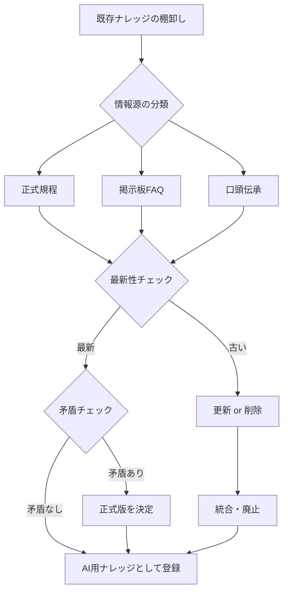
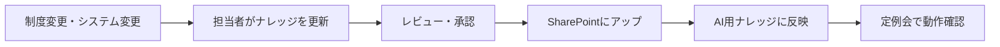

# ナレッジ整理チェックリスト

## 🎯 このチェックリストの目的

散在している社内ナレッジ（規程、FAQ、掲示板情報）を整理し、AIエージェントが正確に回答できる状態にするためのガイドです。

---

## 📋 全体フロー



---

## ステップ1: 既存ナレッジの棚卸し

### チェック項目

#### ✅ 情報源の洗い出し

以下の場所にある情報をリストアップしてください:

- [ ] **正式な規程・マニュアル**
  - 就業規則
  - 旅費規程
  - 経費精算規程
  - 福利厚生規程
  - その他（_____________）

- [ ] **イントラネット・掲示板**
  - 部門掲示板
  - FAQ集
  - お知らせ・通知
  - その他（_____________）

- [ ] **SharePoint / Teams**
  - 部門フォルダ
  - 各種手順書
  - その他（_____________）

- [ ] **メール / チャット**
  - よくあるやり取り
  - テンプレート回答
  - その他（_____________）

- [ ] **口頭のみ**
  - マニュアル化されていない業務知識
  - 暗黙知

---

## ステップ2: 情報の分類と評価

各ナレッジについて、以下のシートで評価してください:

| No | 情報名 | 情報源 | 最終更新日 | 正式版か？ | 重複有無 | アクション |
|:---|:---|:---|:---|:---|:---|:---|
| 1 | 出張旅費申請手順 | 旅費規程 | 2023/4/1 | ✅ | 掲示板にも類似情報 | 規程を正式版とし、掲示板削除 |
| 2 | 有給申請FAQ | 掲示板 | 2021/6/1 | ❌ | 就業規則と内容が違う | 就業規則が正。FAQ削除 |
| 3 | PC貸与申請方法 | 口頭のみ | - | ❌ | なし | マニュアル新規作成 |

---

### 評価基準

#### A. 正式版かどうか？

| 判定 | 説明 |
|:---|:---|
| ✅ **正式版** | 社内規程、公式マニュアルなど、会社として承認されたもの |
| ❌ **非正式版** | 掲示板の個人投稿、口頭伝承、メモ書きなど |

#### B. 最新性

| 判定 | 説明 | アクション |
|:---|:---|:---|
| 🟢 **最新** | 過去1年以内に更新されている | そのまま使用 |
| 🟡 **要確認** | 1〜3年前の情報 | 内容を確認して更新 |
| 🔴 **古い** | 3年以上前、または明らかに古い | 更新 or 削除 |

#### C. 重複・矛盾の有無

| パターン | 説明 | 対応策 |
|:---|:---|:---|
| **同一内容の重複** | 複数箇所に同じ情報がある | 正式版を残し、他を削除 |
| **内容が矛盾** | 情報源によって内容が違う | 正式版を決定し、他を削除 |
| **一部が最新** | 掲示板の補足情報が有用 | 正式版に統合する |

---

## ステップ3: ナレッジの整理アクション

### アクションパターン

#### 🟢 パターンA: そのまま採用

**条件:**
- 正式な規程・マニュアル
- 最新の情報
- 重複・矛盾なし

**アクション:**
- [ ] AI用ナレッジとして登録
- [ ] ファイル形式をテキスト化（PDF → TXTなど）
- [ ] SharePointにアップロード

---

#### 🟡 パターンB: 更新が必要

**条件:**
- 情報は正しいが古い
- 一部の内容が不足している

**アクション:**
- [ ] 担当者に更新を依頼
- [ ] 更新後にAI用ナレッジとして登録

**更新チェックリスト:**
- [ ] 日付・金額などの数値情報は最新か？
- [ ] 制度変更が反映されているか？
- [ ] リンク切れはないか？

---

#### 🔴 パターンC: 削除・統合

**条件:**
- 掲示板の古い投稿
- 正式版と矛盾する情報
- 重複している非正式版

**アクション:**
- [ ] 掲示板から削除（または「古い情報です」と注記）
- [ ] 正式版への統合（有用な補足があれば）
- [ ] 削除した旨を記録（後でトラブルにならないように）

**削除前チェックリスト:**
- [ ] 削除しても問題ないか、関係者に確認
- [ ] 削除する情報のバックアップを取得
- [ ] ユーザーへの周知が必要か？

---

#### 🆕 パターンD: 新規作成

**条件:**
- 口頭でしか伝えていない業務知識
- よく聞かれるが、マニュアルがない

**アクション:**
- [ ] 新規FAQ・マニュアルを作成
- [ ] レビュー・承認プロセスを経る
- [ ] 正式版として登録

**新規作成テンプレート:**
```markdown
# 【タイトル】〇〇の申請方法

## 対象者
〇〇に該当する社員

## 申請タイミング
〇〇の〇日前まで

## 申請方法
1. 〇〇システムにログイン
2. 〇〇メニューから「〇〇申請」を選択
3. 必要事項を入力
4. 提出ボタンをクリック

## 必要書類
- 〇〇（原本 / コピー）
- 〇〇（任意）

## 承認フロー
申請者 → 上長 → 総務

## 問い合わせ先
業務担当 〇〇（内線〇〇〇〇）

## 参照規程
就業規則 第〇条、〇〇規程 第〇条

## 最終更新日
2025年12月3日
```

---

## ステップ4: AI登録前の最終チェック

### チェックリスト

- [ ] **ファイル形式**
  - [ ] テキスト形式（TXT, MD, DOCXなど）
  - [ ] PDFの場合、OCR済みでテキスト抽出可能か？

- [ ] **ファイル名**
  - [ ] わかりやすい名前（例：`交通費精算マニュアル.md`）
  - [ ] バージョン番号や日付を含める（例：`v2.0_20251203`）

- [ ] **内容の正確性**
  - [ ] 誤字脱字がないか？
  - [ ] 数値（金額、日数など）は正確か？
  - [ ] リンク先は有効か？

- [ ] **AIが読みやすい構造**
  - [ ] 見出しが適切に設定されているか？
  - [ ] 箇条書きや表が使われているか？
  - [ ] 長文の場合、段落分けされているか？

---

## ステップ5: 継続的なメンテナンス

### 定期レビュー（推奨頻度）

| 情報の種類 | レビュー頻度 | チェック内容 |
|:---|:---|:---|
| **制度系規程** | 年1回（4月） | 制度変更の反映 |
| **FAQ** | 四半期ごと | 低評価ログから不足を検出 |
| **手順書** | 半年ごと | システム変更の反映 |
| **掲示板** | 月1回 | 古い投稿の削除 |

---

### ナレッジ更新フロー



---

## 📊 ナレッジ整理の進捗管理

### KPI

| 指標 | 初期値 | 目標値 | 現在値 |
|:---|:---|:---|:---|
| 正式版ナレッジ数 | 〇〇件 | 〇〇件 | 〇〇件 |
| 掲示板FAQ削減数 | - | 〇〇件削減 | 〇〇件削減 |
| 新規作成マニュアル数 | - | 〇〇件 | 〇〇件 |
| 矛盾解消数 | - | 〇〇件 | 〇〇件 |

---

## 🚨 よくある課題と対処法

### Q1. どこまで整理すればいいかわからない

**A:** まずは「よく聞かれるTop 10」の関連ナレッジだけに絞ってください。全てを一度に整理する必要はありません。

---

### Q2. 掲示板の情報を削除していいか不安

**A:** 削除ではなく、まずは「【古い情報】正式版は〇〇を参照」と注記してください。しばらく様子を見て問題なければ削除。

---

### Q3. 正式版を決める権限がない

**A:** 関係部署（人事、経理など）と合意形成が必要です。プロジェクトのキックオフ時に承認プロセスを明確にしておきましょう。

---

### Q4. ナレッジが多すぎて追いつかない

**A:** 優先順位をつけてください。
1. **高頻度の質問**から着手
2. 低頻度のものは後回し
3. 「答えられなかった」ログが出たら都度追加

---

## 📞 お問い合わせ

ナレッジ整理で困ったことがあれば、プロジェクトチームまでご連絡ください。

---

**ナレッジ整理は一度やれば終わりではなく、継続的な改善プロセスです。  
焦らず、できる範囲から始めましょう！**
